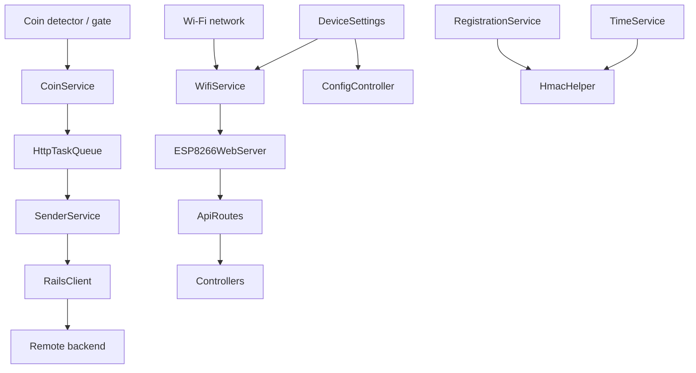

# InternetCafeESP

ESP8266 firmware for an internet cafe coin slot controller. The device connects to Wi-Fi, registers itself with a backend, signs API requests with HMAC, accepts coin pulses, and sends coin/session events to the server over a durable queue.

## Overview

This project is an Arduino-based firmware for a NodeMCU v2 / ESP-12E module running on the ESP8266 platform.

It is designed to:

- Connect to a configured Wi-Fi network
- Provide a local setup page when device settings are missing
- Register the coin slot device with a remote backend
- Track coin pulses from the hardware detector
- Queue outbound HTTP tasks in LittleFS so events survive reboots
- Send authenticated requests to the backend using HMAC headers
- Expose a small local HTTP API for configuration and control

The primary audience is both:

- Developers maintaining or extending the firmware
- Operators configuring or deploying the device on-site

## Features

- Wi-Fi station mode with setup AP fallback
- Web-based device configuration page
- Persistent device settings stored in LittleFS
- Coin pulse detection and aggregation
- Outbound task queue persisted on flash
- HMAC-signed requests for protected endpoints
- Registration, heartbeat, coin enable/disable, reboot, and debug routes
- Remote configuration endpoints

## Tech Stack

- Language: C++
- Framework: Arduino for ESP8266
- Target board: NodeMCU 1.0 / ESP-12E (`nodemcuv2`)
- Build system: PlatformIO
- JSON handling: ArduinoJson 7
- Storage: LittleFS
- Networking: `ESP8266WiFi`, `ESP8266WebServer`, `ESP8266HTTPClient`

## Architecture

The firmware is split into a few clear layers:

- `src/main.cpp` initializes storage, settings, Wi-Fi, routes, and background services
- `src/controllers/` exposes HTTP handlers for config, coin control, debug, ping, and reboot
- `src/core/` contains Wi-Fi and HMAC helpers
- `src/hardware/` handles the coin gate and pulse detector
- `src/services/` manages queueing, registration, heartbeat, time sync, and outbound sending
- `src/config/` stores persistent device settings and board-specific configuration



## Prerequisites

- PlatformIO with the ESP8266 toolchain installed
- An ESP8266 board compatible with `nodemcuv2`
- A serial connection for flashing and monitoring
- A backend server that matches the device API expectations

## Installation

1. Clone or open the repository in PlatformIO.
2. Ensure the target environment is `nodemcuv2`.
3. Build the firmware:

```bash
platformio run
```

4. Flash the device using your PlatformIO workflow for the selected serial port.

## Configuration

Device settings are stored in LittleFS, not in a `.env` file.

Important configuration fields are managed through the firmware and the local config page:

- `wifi_ssid`
- `wifi_password`
- `device_name`
- `server_url`
- `admin_password`
- `use_static_ip`
- `local_ip`
- `gateway`
- `subnet`
- `primary_dns`
- `secondary_dns`

Runtime files used by the firmware:

- `/device_settings.json` for device configuration
- `/secret.txt` for the registration secret and lock state
- `/http_queue.jsonl` for queued outbound tasks

If Wi-Fi settings are missing, the device starts a setup access point instead of silently failing.

## Running Locally

Build the firmware with PlatformIO:

```bash
platformio run
```

The main runtime behavior is on-device:

- The ESP8266 boots the firmware
- It mounts LittleFS
- It loads saved settings
- It attempts Wi-Fi connection
- It starts the local HTTP server
- It processes coin pulses and outbound queue work in the main loop

## Usage

Typical device workflow:

1. Flash the firmware.
2. Configure Wi-Fi and backend settings through the local config page or saved LittleFS settings.
3. Let the device join Wi-Fi.
4. The device registers with the backend when needed.
5. Coin events are accumulated, queued, and sent once the network and time sync are ready.

Local HTTP endpoints are registered in `src/routes/ApiRoutes.h` and handled by the controllers:

- `GET /`
- `GET /config`
- `POST /config`
- `GET /api/device/config`
- `POST /api/device/config`
- `GET /ping`
- `POST /coin/enable`
- `POST /coin/disable`
- `POST /debug/coin-insert`
- `GET /debug/queue`
- `POST /reboot`

Several routes require HMAC headers:

- `X-SIGNATURE`
- `X-TIMESTAMP`

## Testing

No automated test suite is defined in this repository yet.

The only verified command at the moment is the firmware build:

```bash
platformio run
```

## Project Structure

- `src/main.cpp` - application entry point
- `src/config/` - persisted settings and pin/network configuration
- `src/controllers/` - HTTP request handlers
- `src/core/` - Wi-Fi and HMAC helpers
- `src/hardware/` - coin detector and gate control
- `src/models/` - small data structures for events and queued tasks
- `src/routes/` - HTTP route registration
- `src/services/` - registration, queueing, sending, sync, and session state
- `platformio.ini` - PlatformIO environment definition
- `test/` - placeholder for future tests

## Build

Build the firmware for the configured ESP8266 target:

```bash
platformio run
```

## Deployment

The repository does not define a container or cloud deployment flow.

Current deployment is firmware flashing to the ESP8266 board using PlatformIO.

## Development Guidelines

- Keep secrets out of source control.
- Prefer LittleFS-backed configuration for device state.
- Keep HMAC-protected routes fail-closed.
- Avoid blocking work in the main loop where possible.
- Preserve compatibility with the `nodemcuv2` PlatformIO environment.

## Troubleshooting

- If the device starts setup AP mode, check that Wi-Fi SSID, password, and server URL are configured.
- If protected requests are rejected, confirm the device is registered and server time is synced.
- If queue work is not sent, verify network connectivity and backend availability.
- If configuration changes do not persist, check LittleFS mounting and flash health.

## Known Limitations

- No automated test suite is currently defined.
- Registration secrets are persisted in LittleFS rather than a dedicated secure element.
- The backend API contract must match the firmware expectations for registration, heartbeat, and coin events.

## License

No license file was present in the repository at the time of writing.

